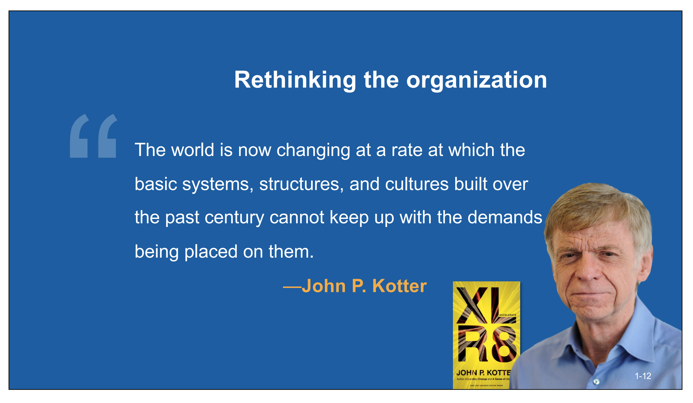
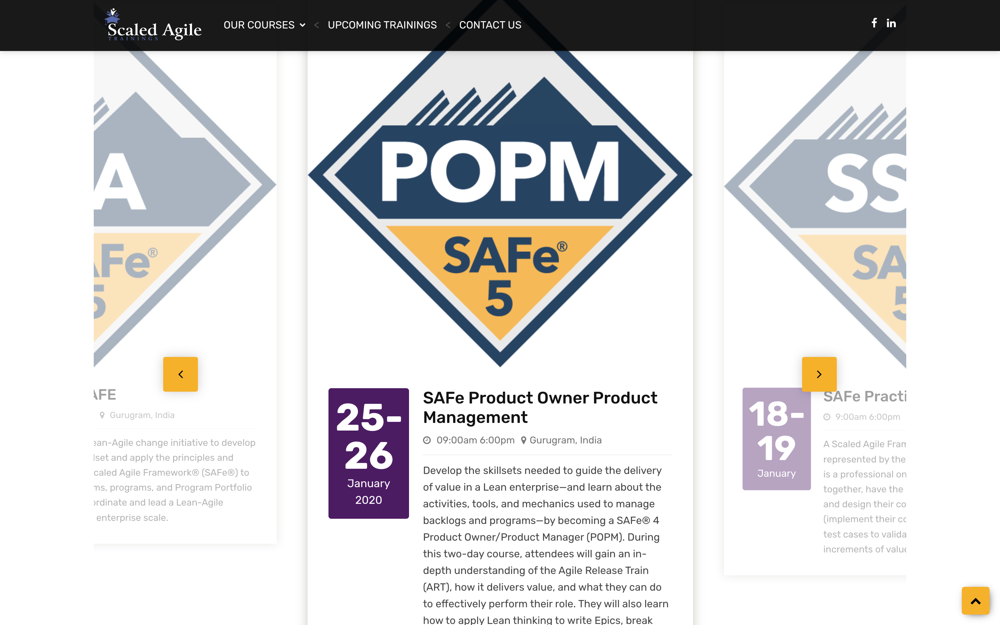
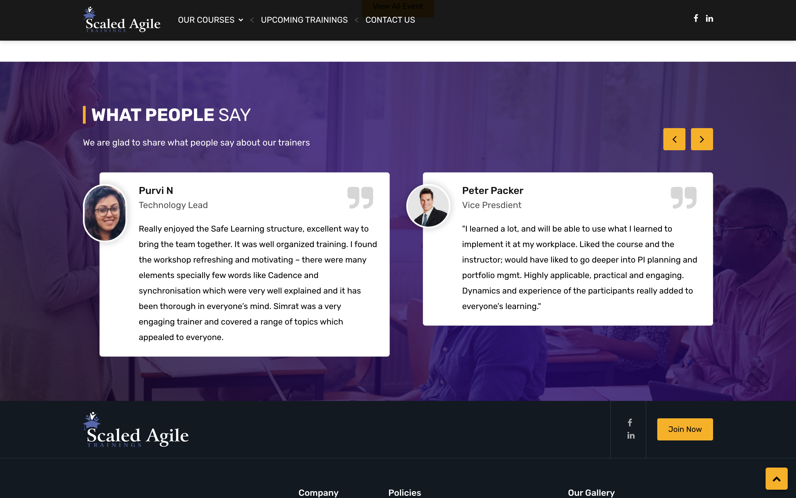
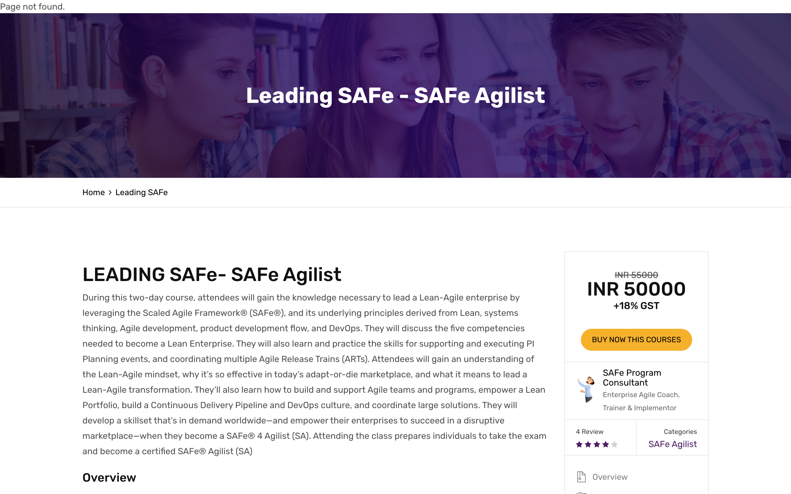
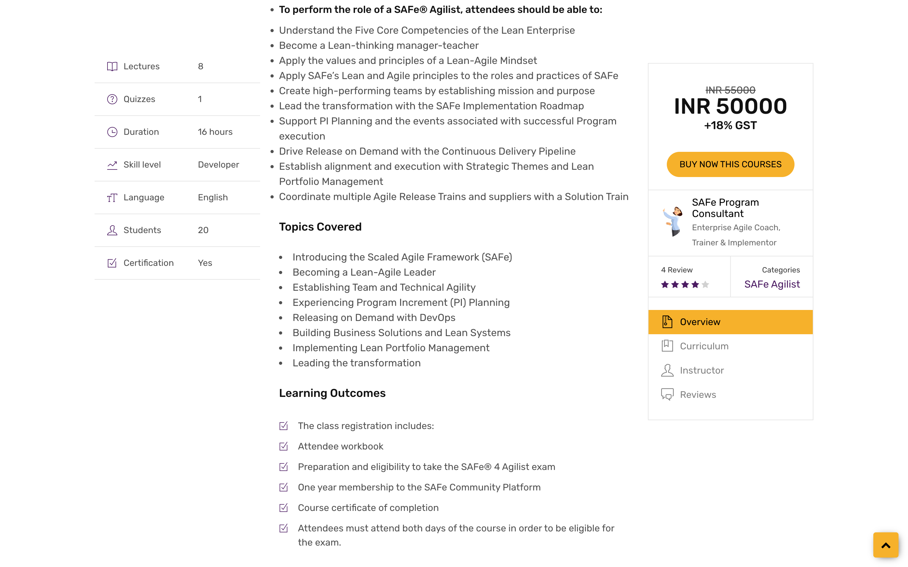
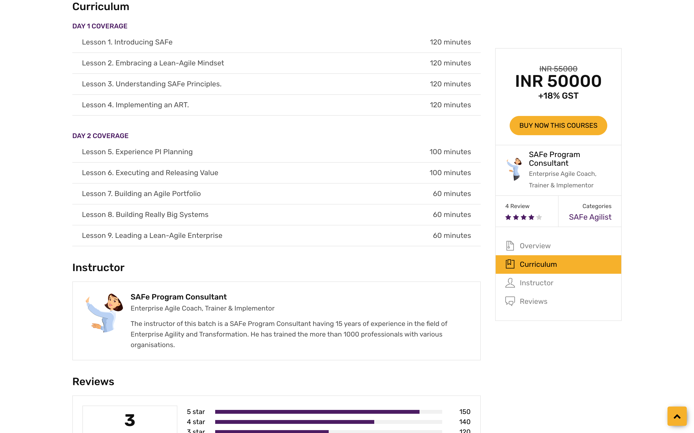

# scaledagile

Fork of this repo https://github.com/Jatinkundra/scaledagile

This project still needs a lot more work, and I'm not willing to devote so much time to it as I have other projects to work on. I just wanted to see what this looks like. After much hard work in my studies over the years, I'm about to finally get my Master's degree this month! 

I recommend https://scaledagileframework.com/ for all your agile training needs. Please hire my professional software development company that I'm starting to fix your projects and meet the never ending demands. I have 15+ years industry experience and am looking for new job right now. PS. the company website is still in the works but should be live and ready to use sometime this year. https://urdasoft.com



## Course of work on this repo from my side

- Add README.md file (this documentation)
- Add requirements.txt file (having project dependencies)
- Add .gitignore file

## Install and Run

```
python3 -m venv .venv
source .venv/bin/activate
pip3 install -r requirements.txt
python manage.py migrate
python manage.py runserver
open http://127.0.0.1:8000/index/
```

# Screenshots

### Index Page






### Leading SAFe Page







# Looking for a great consultant? Hire UrdaSoft!

- My Company Email [urdasoft@gmail.com](urdasoft@gmail.com)
- My Personal Email [alex@goretoy.com](alex@goretoy.com)
